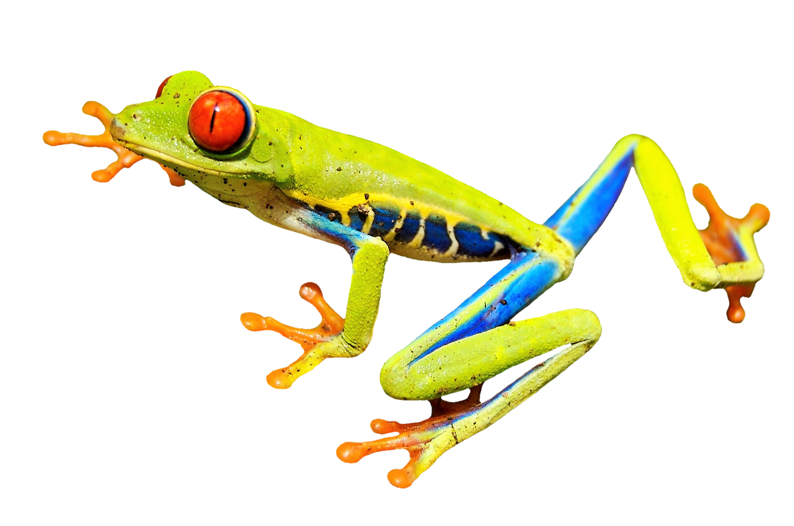
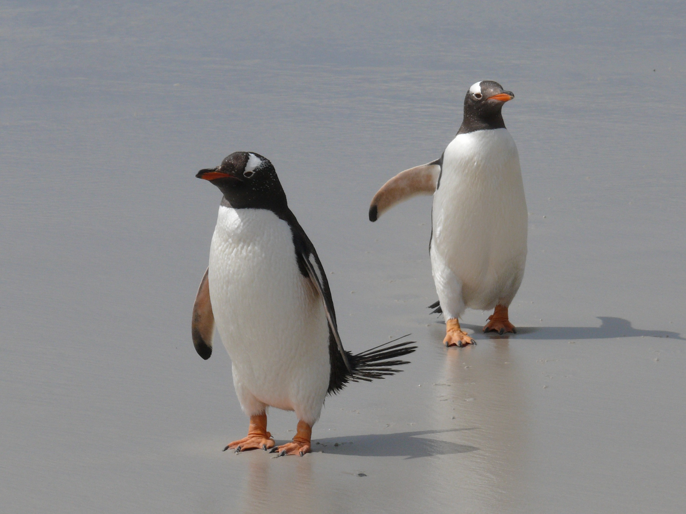

```{r setup, include = FALSE}
library(tidyverse)
library(gganimate)
library(RColorBrewer)
library(knitr)
library(DiagrammeR)
library(palmerpenguins)
```

<!-- adding bold and italic options -->
<style>
em {
  font-style: italic
}
strong {
  font-weight: bold;
}
</style>

## This presentation was generated in R

- Written in `Rmarkdown`
- Using `slidify` R package
- Assemblage of multiple software packages (e.g. `knitr`)
- Nice features and (small) active online community
- `Rmarkdown` code is translated into html
- Can be viewed in web browser (e.g. Google Chrome)

--- .class #id

## `Slidify` installation

<iframe src = 'https://slidify.github.io/index.html' height='600px'></iframe>

--- .segue .dark 

## First there were dancing graphs

--- .class bg:white

## R package `gganimate`

```{r, out.width = "95%", out.height = "95%", fig.width = 8, fig.height = 4.75, dpi = 600, fig.align = "center", echo = FALSE}
# get data as tibble
height_data <- read_tsv("./data/Galton.txt",
  col_types= cols(
    Family = col_character(),
    Father = col_double(),
    Mother = col_double(),
    Gender = col_character(),
    Height = col_double(),
    Kids = col_integer()
  )
)

# convert inches: metres = inch/39.37
height_m <- mutate(height_data,
  fth = Father / 39.37,
  mth = Mother / 39.37,
  hgt = Height / 39.37
)

# histogram of heights
all_hist <- ggplot(height_m) +
  geom_histogram(aes(x = hgt), binwidth = 0.035, colour = "black", fill = "coral") +
  theme_bw(base_size = 15) +
  labs(x="height (m)", y="count")

# animate plot
ani <- all_hist +
  transition_states(Gender, 
    transition_length = 1,
    state_length = 1
  ) +
  ease_aes('cubic-in-out')

ani

```

--- .class #id

## With a general hatred of Powerpoint

>- Previously used open source `libreoffice impress`
>- Or `inkscape` vector image editor!
>- Difficult to include/edit **high quality graphics**
>- **No time reduction** of repetitive tasks
>- Making **high quality/consistent slides** challenging
>- **Animations** difficult to impossible
>- `Beamer` package from `Latex` was an option, but **difficult to integrate R**
>- `Rmarkdown` seemed to tick all the boxes

--- .segue .dark 

## A tour of features

--- .class #id

## Github hosting and access

<iframe src = 'https://github.com/drabarlow/' height='600px'></iframe>

--- .class #id

## YAML front matter

```console
---
title       : "Making presentation slides in R"
subtitle    : "Coffee & R"
author      : Dr Axel Barlow
job         : "email: a.barlow@bangor.ac.uk"
framework   : io2012        # {io2012, html5slides, shower, dzslides, ...}
highlighter : highlight.js  # {highlight.js, prettify, highlight}
hitheme     : zenburn      # {zenburn, tomorrow, solarized-dark, ...}
widgets     : []            # {mathjax, quiz, bootstrap}
mode        : selfcontained # {selfcontained, standalone, draft}
knit        : slidify::knit2slides
logo        : LA_Full_colour_reversed.svg
biglogo     : A1_FullColour.svg
assets      : {assets: ../../assets}
license     : by-nc-sa
github:
  user: drabarlow
  repo: Ax_slidify_eg_bangor
  branch: "gh-pages"
---
```

--- .class #id

## Slide formatting

### Header 2

- list1
- list2

1. Numbered list1
2. Numbered list2

>- Appear on click

>- **bold**
>- *italic*
>- `inline code`  

--- .class #id

## Code

```console
--- .class #id

## Slide formatting

### Header 2

- list1
- list2

1. Numbered list1
2. Numbered list2

>- Appear on click

>- **bold**
>- *italic*
>- `inline code`  
```

--- &twocol

## Two column layout

### Here's an alternative layout

*** =left

- list1
- list2
- list3
- list4
- list5
- list6
- list7
- list8

*** =right

```{r, out.width = "100%", dpi = 300, echo = FALSE}

```

*Random frog picture*

--- .class #id

## Code

```console
--- &twocol

## Two column layout

#*** =left

#*** =right

```

--- .class #id

## Tables

```console
|Subject|Emotion|Object|
|----|----|----|
|I|hate|Powerpoint|
|I|love|Rmarkdown|
```

|Subject|Emotion|Object|
|----|----|----|
|I|hate|Powerpoint|
|I|love|Rmarkdown|

--- .class #id

## Or for dataframes or tibbles...

```{r, echo=FALSE}
header <- c("Subject", "Emotion", "Object")
row1 <- as.data.frame(t(c("I", "hate", "Powerpoint")))
row2 <- as.data.frame(t(c("I", "love", "Rmarkdown")))
my.dataframe <- rbind(row1, row2)
colnames(my.dataframe) <- header
```

```{r, echo = TRUE}
my.dataframe
```

```{r, echo = TRUE}
kable(my.dataframe)
```

--- .class #id

## Code chunks

    ```<language, echo=TRUE/FALSE, eval=TRUE/FALSE, other stuff>
    ... code
    ```

### R code
```{r, echo=TRUE}
print("this is R code")
```

### bash
```{bash}
echo "this is bash"
```

--- .class bg:white

## Plots

- The plot is generated within an R code chunk and plotted to the slide

```{r, out.width = "65%", out.height = "65%", fig.width = 9, fig.height = 7, dpi = 600, fig.align = "center", echo = FALSE}
my.dat <- rnorm(100, 10, 1)
my.df <- enframe(my.dat)

plot <- ggplot(my.df) +
  geom_histogram(aes(x = value), colour="black", fill="lightblue", bins = 10) +
  theme_bw(base_size = 25)

plot
```

--- .class #id

## Code

### This is what the R chunk looks like

```console
#```{r, out.width = "65%", out.height = "65%", fig.width = 9, fig.height = 7, 
#dpi = 600, fig.align = "center", echo = FALSE}
my.dat <- rnorm(100, 10, 1)
my.df <- enframe(my.dat)

plot <- ggplot(my.df) +
  geom_histogram(aes(x = value), colour="black", fill="lightblue", bins = 10) +
  theme_bw(base_size = 25)

plot
#```
```

--- .class #id

## Images

```{r, out.width = "45%", dpi = 300, echo = FALSE, fig.align='center'}
include_graphics("./assets/img/smilodon1.png")
```

### Code

```console
#```{r, out.width = "45%", dpi = 300, echo = FALSE, fig.align='center'}
include_graphics("./assets/img/smilodon1.png")
#```
```

--- .class #id

## Complex images

```{r, out.width = "60%", dpi = 300, echo = FALSE, fig.align='center'}
include_graphics("./assets/img/aDNA_seq.svg")
```

### Code

```console
#```{r, out.width = "60%", dpi = 300, echo = FALSE, fig.align='center'}
include_graphics("./assets/img/aDNA_seq.svg")
#```
```


--- .class #id

## Embedding websites

<iframe src = 'https://pleistocenegenomics.com' height='600px'></iframe>

--- .class #id

## Code

```console
 <iframe src = 'https://pleistocenegenomics.com' height='600px'></iframe>
```

--- .class #id

## Embedding pdfs

```{r, out.width = "100%", out.height=500, dpi = 300, echo = FALSE}
include_graphics("./assets/img/Paijmans et al. - 2017.pdf")
```

--- .class #id

## Code

```console
#```{r, out.width = "100%", out.height=500, dpi = 300, echo = FALSE}
include_graphics("./assets/img/Paijmans et al. - 2017.pdf")
#```
```

--- .segue .dark 

## Has it helped? [note segue layout]

--- &twocol

## Histogram example

*** =left

- Heights of 898 people, in metres 

```{r, echo = FALSE}
metres <- read.table("./data/heights", header=TRUE)
head(metres, 13)
```

*** =right

- Binned data

```{r, echo = FALSE, }
h <- hist(metres$height, breaks=14, plot=FALSE)
d <- data.frame(h$breaks[1:13], h$breaks[2:14], h$counts)
names(d)[1:3] <- c("start", "finish", "counts")

print(d)
```

--- .class bg:white

## Histogram example

- Using 14 bins

```{r, out.width = "60%", out.height = "60%", fig.width = 9, fig.height = 7, dpi = 600, fig.align = "center", echo = FALSE}
plot <- ggplot(metres) +
  geom_histogram(aes(x = height), colour="black", fill="lightblue", show.legend=FALSE, bins = 14) +
  theme_bw(base_size = 25)

plot
```

--- .class bg:white

## Effect of bin size

- Using 7 bins

```{r, out.width = "60%", out.height = "60%", fig.width = 9, fig.height = 7, dpi = 600, fig.align = "center", echo = FALSE}
plot <- ggplot(metres) +
  geom_histogram(aes(x = height), colour="black", fill="lightblue", show.legend=FALSE, bins = 7) +
  theme_bw(base_size = 25)

plot
```

--- .class bg:white

## Effect of bin size

- Using 28 bins

```{r, out.width = "60%", out.height = "60%", fig.width = 9, fig.height = 7, dpi = 600, fig.align = "center", echo = FALSE}
plot <- ggplot(metres) +
  geom_histogram(aes(x = height), colour="black", fill="lightblue", show.legend=FALSE, bins = 28) +
  theme_bw(base_size = 25)

plot
```

--- .segue .dark 

## Penguins

--- &twocol bg:white

## Penguins

- Body mass: quantitative continuous
- Species: categorical

*** =left

```{r, out.width = "100%", dpi = 300, echo = FALSE}

```

**Chinstrap penguin**

*** =right

```{r, out.width = "100%", dpi = 300, echo = FALSE}

```

**Gentoo penguin**

--- .class bg:white

## Data visualisation

```{r, out.width = "100%", out.height = "100%", fig.width = 12, fig.height = 7, dpi = 600, fig.align = "center", echo = FALSE}
gen_chi <- filter(penguins, species %in% c("Chinstrap", "Gentoo"))
gen_chi <- gen_chi %>% drop_na()

plot <- ggplot(gen_chi) +
  geom_histogram(aes(x=body_mass_g, fill=species), colour="black", alpha = 0.75, show.legend=TRUE, bins = 40) +
  xlab("body mass (g)") +
  theme_bw(base_size = 20) +
  
  theme(
    panel.grid.major = element_blank(),
    panel.grid.minor = element_blank(),
  )

plot
```

--- &twocol bg:white

## Box plot

*** =left

- Also know as a box and whisker plot
- The box shows:
  + **Median** (50th percentile)
  + **lower quartile** (25th percentile)
  + **upper quartile** (75th percentile)
- Note upper - lower quartile is the **interquartile range**
- **Whiskers** extend to the furthest data point within 1.5 x the interquartile range
- Anything outside this range is an **outlier**

  
*** =right

```{r, out.width = "95%", out.height = "95%", fig.width = 6, fig.height = 7, dpi = 600, fig.align = "center", echo = FALSE}

plo <- ggplot(gen_chi, aes(x=species, y=body_mass_g, fill=species)) +
  geom_boxplot(alpha = 0.75, position="identity", show.legend=FALSE) +
  theme_bw(base_size = 20) +
  xlab("") +
  ylab("body mass (g)") +
  
  theme(
    panel.grid.major = element_blank(),
    panel.grid.minor = element_blank(),
  )

plo
```

--- &twocol bg:white

## Barchart

*** =left

- Species goes on the x axis
- **Mean** body mass on the y axis
- **Error bars** often used to display the sample variation
- +/- one **standard deviation** in this example

*** =right

```{r, out.width = "95%", out.height = "95%", fig.width = 6, fig.height = 7, dpi = 600, fig.align = "center", echo = FALSE}
mean_sd <- group_by(gen_chi, species) %>% summarize(mean_mass = mean(body_mass_g), sd = sd(body_mass_g))

plot_bar <- ggplot(mean_sd, aes(species, mean_mass, fill=species)) +
  geom_col(show.legend=FALSE) +
  geom_errorbar(aes(ymin=mean_mass-sd, ymax=mean_mass+sd), width = 0.5) +
  ylab("body mass (g)") +
  theme_bw(base_size = 20) +
  
  theme(
    panel.grid.major = element_blank(),
    panel.grid.minor = element_blank(),
  )

plot_bar
```

--- .class bg:white

## Showing the data points

```{r, out.width = "100%", out.height = "100%", fig.width = 12, fig.height = 7, dpi = 600, fig.align = "center", echo = FALSE}

plot_bar2 <- ggplot(gen_chi, aes(species, body_mass_g, colour=species)) +
  geom_jitter(width=0.15) +
  stat_summary(fun="mean", geom="point", colour="black", cex=5) +
  ylab("body mass (g)") +
  theme_bw(base_size = 25) +
  
  theme(
    panel.grid.major = element_blank(),
    panel.grid.minor = element_blank(),
  )

plot_bar2
```

--- .segue .dark 

## Sample sizes

--- .class #id

## A simple example:

- There are two student groups, you hypothesise that one is taller than the other
- Height is a normally distributed continuous quantitative variable
- **Null hypothesis**: there is no difference in (the distribution of) height between the two groups
- **Alternate hypothesis**: there is a difference
- You measure 10 students from each group and compare...

--- .class bg:white

## Comparison 1

```{r, out.width = "100%", out.height = "100%", fig.width = 12, fig.height = 7, dpi = 600, fig.align = "center", echo = FALSE}
group1 <- enframe(rnorm(10, 170, 10))
group2 <- enframe(rnorm(10, 170, 10))
group1$group <- "1"
group2$group <- "2"
two_dist <- rbind(group1, group2)

my_plot <- ggplot(two_dist, aes(group, value, colour=group)) +
  geom_jitter(width=0.15, cex=4) +
  ylab("Height (cm)") +
  theme_bw(base_size = 25) +
  
  theme(
    panel.grid.major = element_blank(),
    panel.grid.minor = element_blank(),
  )

my_plot
```

--- .class bg:white

## Comparison 2

```{r, out.width = "100%", out.height = "100%", fig.width = 12, fig.height = 7, dpi = 600, fig.align = "center", echo = FALSE}
group1 <- enframe(rnorm(10, 170, 10))
group2 <- enframe(rnorm(10, 170, 10))
group1$group <- "1"
group2$group <- "2"
two_dist <- rbind(group1, group2)

my_plot <- ggplot(two_dist, aes(group, value, colour=group)) +
  geom_jitter(width=0.15, cex=4) +
  ylab("Height (cm)") +
  theme_bw(base_size = 25) +
  
  theme(
    panel.grid.major = element_blank(),
    panel.grid.minor = element_blank(),
  )

my_plot
```

--- .class bg:white

## Comparison 3

```{r, out.width = "100%", out.height = "100%", fig.width = 12, fig.height = 7, dpi = 600, fig.align = "center", echo = FALSE}
group1 <- enframe(rnorm(10, 170, 10))
group2 <- enframe(rnorm(10, 170, 10))
group1$group <- "1"
group2$group <- "2"
two_dist <- rbind(group1, group2)

my_plot <- ggplot(two_dist, aes(group, value, colour=group)) +
  geom_jitter(width=0.15, cex=4) +
  ylab("Height (cm)") +
  theme_bw(base_size = 25) +
  
  theme(
    panel.grid.major = element_blank(),
    panel.grid.minor = element_blank(),
  )

my_plot
```

--- .class bg:white

## Comparison 4

```{r, out.width = "100%", out.height = "100%", fig.width = 12, fig.height = 7, dpi = 600, fig.align = "center", echo = FALSE}
group1 <- enframe(rnorm(10, 170, 10))
group2 <- enframe(rnorm(10, 170, 10))
group1$group <- "1"
group2$group <- "2"
two_dist <- rbind(group1, group2)

my_plot <- ggplot(two_dist, aes(group, value, colour=group)) +
  geom_jitter(width=0.15, cex=4) +
  ylab("Height (cm)") +
  theme_bw(base_size = 25) +
  
  theme(
    panel.grid.major = element_blank(),
    panel.grid.minor = element_blank(),
  )

my_plot
```

--- .segue .dark

## So are the groups different?

--- .class #id

## All the groups are sampled from the same normal distribution

```{r, echo = TRUE}
group1 <- rnorm(10, 170, 10)
group2 <- rnorm(10, 170, 10)

group1

group2
```

--- .segue .dark

## Now let's increase the sample size

--- .class bg:white

## Comparison 1

```{r, out.width = "100%", out.height = "100%", fig.width = 12, fig.height = 7, dpi = 600, fig.align = "center", echo = FALSE}
group1 <- enframe(rnorm(100, 170, 10))
group2 <- enframe(rnorm(100, 170, 10))
group1$group <- "1"
group2$group <- "2"
two_dist <- rbind(group1, group2)

my_plot <- ggplot(two_dist, aes(group, value, colour=group)) +
  geom_jitter(width=0.15, cex=4) +
  ylab("Height (cm)") +
  theme_bw(base_size = 25) +
  
  theme(
    panel.grid.major = element_blank(),
    panel.grid.minor = element_blank(),
  )

my_plot
```

--- .class bg:white

## Comparison 2

```{r, out.width = "100%", out.height = "100%", fig.width = 12, fig.height = 7, dpi = 600, fig.align = "center", echo = FALSE}
group1 <- enframe(rnorm(100, 170, 10))
group2 <- enframe(rnorm(100, 170, 10))
group1$group <- "1"
group2$group <- "2"
two_dist <- rbind(group1, group2)

my_plot <- ggplot(two_dist, aes(group, value, colour=group)) +
  geom_jitter(width=0.15, cex=4) +
  ylab("Height (cm)") +
  theme_bw(base_size = 25) +
  
  theme(
    panel.grid.major = element_blank(),
    panel.grid.minor = element_blank(),
  )

my_plot
```

--- .class bg:white

## Comparison 3

```{r, out.width = "100%", out.height = "100%", fig.width = 12, fig.height = 7, dpi = 600, fig.align = "center", echo = FALSE}
group1 <- enframe(rnorm(100, 170, 10))
group2 <- enframe(rnorm(100, 170, 10))
group1$group <- "1"
group2$group <- "2"
two_dist <- rbind(group1, group2)

my_plot <- ggplot(two_dist, aes(group, value, colour=group)) +
  geom_jitter(width=0.15, cex=4) +
  ylab("Height (cm)") +
  theme_bw(base_size = 25) +
  
  theme(
    panel.grid.major = element_blank(),
    panel.grid.minor = element_blank(),
  )

my_plot
```

--- .class bg:white

## Comparison 4

```{r, out.width = "100%", out.height = "100%", fig.width = 12, fig.height = 7, dpi = 600, fig.align = "center", echo = FALSE}
group1 <- enframe(rnorm(100, 170, 10))
group2 <- enframe(rnorm(100, 170, 10))
group1$group <- "1"
group2$group <- "2"
two_dist <- rbind(group1, group2)

my_plot <- ggplot(two_dist, aes(group, value, colour=group)) +
  geom_jitter(width=0.15, cex=4) +
  ylab("Height (cm)") +
  theme_bw(base_size = 25) +
  
  theme(
    panel.grid.major = element_blank(),
    panel.grid.minor = element_blank(),
  )

my_plot
```

--- .segue .dark

## Using other people's code

--- .class bg:white

## `r` shows the strength of correlation

```{r, out.width = "100%", fig.width = 12, fig.height = 6, dpi = 600, fig.align = "center", echo = FALSE}
#Title: An example of the correlation of x and y for various distributions of (x,y) pairs
#Tags: Mathematics; Statistics; Correlation
#Author: Denis Boigelot
#Packets needed : mvtnorm (rmvnorm), RSVGTipsDevice (devSVGTips)
#How to use: output()
#
#This is an translated version in R of an Matematica 6 code by Imagecreator.

library(mvtnorm)
#library(RSVGTipsDevice)

MyPlot <- function(xy, xlim = c(-4, 4), ylim = c(-4, 4), eps = 1e-15) {
   title = round(cor(xy[,1], xy[,2]), 1)
   if (sd(xy[,2]) < eps) title = "" # corr. coeff. is undefined
   plot(xy, main = title, cex.main = 2, xlab = "", ylab = "",
        col = "darkblue", pch = 16, cex = 0.8,
        xaxt = "n", yaxt = "n", bty = "n",
        xlim = xlim, ylim = ylim)
}

MvNormal <- function(n = 1000, cor = 0.8) {
   for (i in cor) {
      sd = matrix(c(1, i, i, 1), ncol = 2)
      x = rmvnorm(n, c(0, 0), sd)
      MyPlot(x)
   }
}

rotation <- function(t, X) return(X %*% matrix(c(cos(t), sin(t), -sin(t), cos(t)), ncol = 2))

RotNormal <- function(n = 1000, t = pi/2) {
   sd = matrix(c(1, 1, 1, 1), ncol = 2)
   x = rmvnorm(n, c(0, 0), sd)
   for (i in t)
      MyPlot(rotation(i, x))
}

Others <- function(n = 1000) {
   x = runif(n, -1, 1)
   y = 4 * (x^2 - 1/2)^2 + runif(n, -1, 1)/3
   MyPlot(cbind(x,y), xlim = c(-1, 1), ylim = c(-1/3, 1+1/3))

   y = runif(n, -1, 1)
   xy = rotation(-pi/8, cbind(x,y))
   lim = sqrt(2+sqrt(2)) / sqrt(2)
   MyPlot(xy, xlim = c(-lim, lim), ylim = c(-lim, lim))

   xy = rotation(-pi/8, xy)
   MyPlot(xy, xlim = c(-sqrt(2), sqrt(2)), ylim = c(-sqrt(2), sqrt(2)))
   
   y = 2*x^2 + runif(n, -1, 1)
   MyPlot(cbind(x,y), xlim = c(-1, 1), ylim = c(-1, 3))

   y = (x^2 + runif(n, 0, 1/2)) * sample(seq(-1, 1, 2), n, replace = TRUE)
   MyPlot(cbind(x,y), xlim = c(-1.5, 1.5), ylim = c(-1.5, 1.5))

   y = cos(x*pi) + rnorm(n, 0, 1/8)
   x = sin(x*pi) + rnorm(n, 0, 1/8)
   MyPlot(cbind(x,y), xlim = c(-1.5, 1.5), ylim = c(-1.5, 1.5))

   xy1 = rmvnorm(n/4, c( 3,  3))
   xy2 = rmvnorm(n/4, c(-3,  3))
   xy3 = rmvnorm(n/4, c(-3, -3))
   xy4 = rmvnorm(n/4, c( 3, -3))
   MyPlot(rbind(xy1, xy2, xy3, xy4), xlim = c(-3-4, 3+4), ylim = c(-3-4, 3+4))
}

output <- function() {
#   devSVGTips(width = 7, height = 3.2) # remove first and last line for no svg exporting
#   par(mfrow = c(3, 7), oma = c(0,0,0,0), mar=c(2,2,2,0))
#   MvNormal(800, c(1.0, 0.8, 0.4, 0.0, -0.4, -0.8, -1.0));
#   RotNormal(200, c(0, pi/12, pi/6, pi/4, pi/2-pi/6, pi/2-pi/12, pi/2));
#   Others(800)
#   dev.off() # remove first and last line for no svg exporting

   par(mfrow = c(2, 4), oma = c(0,0,0,0), mar=c(2,2,2,0))
   MvNormal(800, c(1.0, 0.8, 0.4, 0.00));
   MvNormal(800, c(0.0, -0.4, -0.8, -1.0));

}

output()
```

*R code for plot by Denis Boigelot*

--- .segue .dark

## Ice cream

--- .class bg:white

## Eating ice cream does not cause dehydration

```{r, out.width = "80%", fig.width = 12, fig.height = 7, dpi = 600, fig.align = "center", echo = FALSE}
ice_can <- data.frame(icecream=jitter(1:10, factor=3), cancer=jitter(11:20, factor=5))

plot_scatter2 <- ggplot(ice_can, aes(icecream, cancer)) +
  geom_point(cex=5, pch=21, fill="darkred") +
  geom_smooth(method=lm, formula = y~x, se=FALSE, col="black", lwd=1) +
  theme_bw(base_size = 20) +
  xlab("Ice cream sales (thousand per month)") +
  ylab("Dehydration (% admissions per month)") +
  ggtitle("r = 0.977, p < 0.01")+
  
  theme(
    panel.grid.major = element_blank(),
    panel.grid.minor = element_blank(),
  )

plot_scatter2
```

```console
ice_cream <- data.frame(icecream=jitter(1:10, factor=3), cancer=jitter(11:20, factor=5))
```

--- &thankyou

## Thank you

**Now a look "behind the scenes"**


