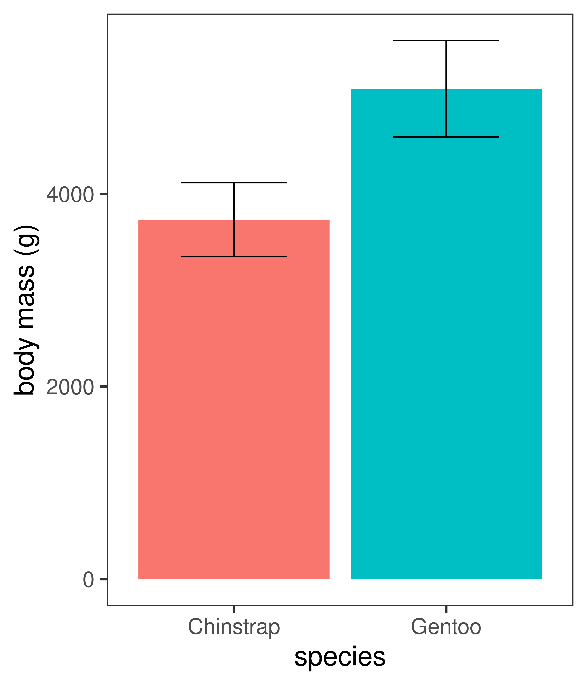
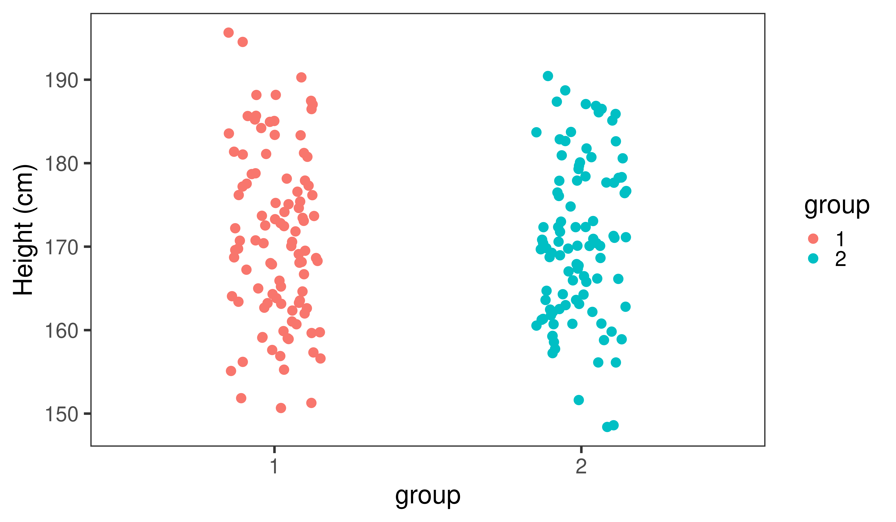

<!-- adding bold and italic options -->
<style>
em {
  font-style: italic
}
strong {
  font-weight: bold;
}
</style>

## This presentation was generated in R

- Written in `Rmarkdown`
- Using `slidify` R package
- Assemblage of multiple software packages (e.g. `knitr`)
- Nice features and (small) active online community
- `Rmarkdown` code is translated into html
- Can be viewed in web browser (e.g. Google Chrome)

--- .class #id

## `Slidify` installation

<iframe src = 'https://slidify.github.io/index.html' height='600px'></iframe>

--- .segue .dark 

## First there were dancing graphs

--- .class bg:white

## R package `gganimate`


--- .class #id

## With a general hatred of Powerpoint

>- Previously used open source `libreoffice impress`
>- Or `inkscape` vector image editor!
>- Difficult to include/edit **high quality graphics**
>- **No time reduction** of repetitive tasks
>- Making **high quality/consistent slides** challenging
>- **Animations** difficult to impossible
>- `Beamer` package from `Latex` was an option, but **difficult to integrate R**
>- `Rmarkdown` seemed to tick all the boxes

--- .segue .dark 

## A tour of features

--- .class #id

## Github hosting and access

--- .class #id

## YAML front matter

```console
---
title       : "Making presentation slides in R"
subtitle    : "Coffee & R"
author      : Dr Axel Barlow
job         : "email: a.barlow@bangor.ac.uk"
framework   : io2012        # {io2012, html5slides, shower, dzslides, ...}
highlighter : highlight.js  # {highlight.js, prettify, highlight}
hitheme     : zenburn      # {zenburn, tomorrow, solarized-dark, ...}
widgets     : []            # {mathjax, quiz, bootstrap}
mode        : selfcontained # {selfcontained, standalone, draft}
knit        : slidify::knit2slides
logo        : LA_Full_colour_reversed.svg
biglogo     : A1_FullColour.svg
assets      : {assets: ../../assets}
license     : by-nc-sa
github:
  user: draxelbarlow
  repo: Ax_slidify_eg_bangor
  branch: "gh-pages"
---
```

--- .class #id

## Slide formatting

### Header 2

- list1
- list2

1. Numbered list1
2. Numbered list2

>- Appear on click

>- **bold**
>- *italic*
>- `inline code`  

--- .class #id

## Code

```console
--- .class #id

## Slide formatting

### Header 2

- list1
- list2

1. Numbered list1
2. Numbered list2

>- Appear on click

>- **bold**
>- *italic*
>- `inline code`  
```

--- &twocol

## Two column layout

### Here's an alternative layout

*** =left

- list1
- list2
- list3
- list4
- list5
- list6
- list7
- list8

*** =right


*Random frog picture*

--- .class #id

## Code

```console
--- &twocol

## Two column layout

#*** =left

#*** =right

```

--- .class #id

## Tables

```console
|Subject|Emotion|Object|
|----|----|----|
|I|hate|Powerpoint|
|I|love|Rmarkdown|
```

|Subject|Emotion|Object|
|----|----|----|
|I|hate|Powerpoint|
|I|love|Rmarkdown|

--- .class #id

## Or for dataframes or tibbles...


```r
my.dataframe
```

```
##   Subject Emotion     Object
## 1       I    hate Powerpoint
## 2       I    love  Rmarkdown
```


```r
kable(my.dataframe)
```


|Subject |Emotion |Object     |
|:-------|:-------|:----------|
|I       |hate    |Powerpoint |
|I       |love    |Rmarkdown  |

--- .class #id

## Code chunks

    ```<language, echo=TRUE/FALSE, eval=TRUE/FALSE, other stuff>
    ... code
    ```

### R code

```r
print("this is R code")
```

```
## [1] "this is R code"
```

### bash

```bash
echo "this is bash"
```

```
## this is bash
```

--- .class bg:white

## Plots

- The plot is generated within an R code chunk and plotted to the slide


--- .class #id

## Code

### This is what the R chunk looks like

```console
#```{r, out.width = "65%", out.height = "65%", fig.width = 9, fig.height = 7, 
#dpi = 600, fig.align = "center", echo = FALSE}
my.dat <- rnorm(100, 10, 1)
my.df <- enframe(my.dat)

plot <- ggplot(my.df) +
  geom_histogram(aes(x = value), colour="black", fill="lightblue", bins = 10) +
  theme_bw(base_size = 25)

plot
#```
```

--- .class #id

## Images


### Code

```console
#```{r, out.width = "45%", dpi = 300, echo = FALSE, fig.align='center'}
include_graphics("./assets/img/smilodon1.png")
#```
```

--- .class #id

## Complex images


### Code

```console
#```{r, out.width = "60%", dpi = 300, echo = FALSE, fig.align='center'}
include_graphics("./assets/img/aDNA_seq.svg")
#```
```


--- .class #id

## Embedding websites

<iframe src = 'https://pleistocenegenomics.com' height='600px'></iframe>

--- .class #id

## Code

```console
 <iframe src = 'https://pleistocenegenomics.com' height='600px'></iframe>
```

--- .class #id

## Embedding pdfs

<embed src="./assets/img/Paijmans et al. - 2017.pdf" title="plot of chunk unnamed-chunk-11" alt="plot of chunk unnamed-chunk-11" width="100%" height="500" type="application/pdf" />

--- .class #id

## Code

```console
#```{r, out.width = "100%", out.height=500, dpi = 300, echo = FALSE}
include_graphics("./assets/img/Paijmans et al. - 2017.pdf")
#```
```

--- .segue .dark 

## Has it helped? [note segue layout]

--- &twocol

## Histogram example

*** =left

- Heights of 898 people, in metres 


```
##    height
## 1    1.86
## 2    1.76
## 3    1.75
## 4    1.75
## 5    1.87
## 6    1.84
## 7    1.66
## 8    1.66
## 9    1.80
## 10   1.73
## 11   1.79
## 12   1.74
## 13   1.70
```

*** =right

- Binned data


```
##    start finish counts
## 1   1.40   1.45      3
## 2   1.45   1.50      3
## 3   1.50   1.55     44
## 4   1.55   1.60    122
## 5   1.60   1.65    163
## 6   1.65   1.70    171
## 7   1.70   1.75    149
## 8   1.75   1.80    146
## 9   1.80   1.85     76
## 10  1.85   1.90     13
## 11  1.90   1.95      6
## 12  1.95   2.00      1
## 13  2.00   2.05      1
```

--- .class bg:white

## Histogram example

- Using 14 bins


--- .class bg:white

## Effect of bin size

- Using 7 bins


--- .class bg:white

## Effect of bin size

- Using 28 bins


--- .segue .dark 

## Penguins

--- &twocol bg:white

## Penguins

- Body mass: quantitative continuous
- Species: categorical

*** =left


**Chinstrap penguin**

*** =right


**Gentoo penguin**

--- .class bg:white

## Data visualisation


--- &twocol bg:white

## Box plot

*** =left

- Also know as a box and whisker plot
- The box shows:
  + **Median** (50th percentile)
  + **lower quartile** (25th percentile)
  + **upper quartile** (75th percentile)
- Note upper - lower quartile is the **interquartile range**
- **Whiskers** extend to the furthest data point within 1.5 x the interquartile range
- Anything outside this range is an **outlier**

  
*** =right


--- &twocol bg:white

## Barchart

*** =left

- Species goes on the x axis
- **Mean** body mass on the y axis
- **Error bars** often used to display the sample variation
- +/- one **standard deviation** in this example

*** =right



--- .class bg:white

## Showing the data points


--- .segue .dark 

## Sample sizes

--- .class #id

## A simple example:

- There are two student groups, you hypothesise that one is taller than the other
- Height is a normally distributed continuous quantitative variable
- **Null hypothesis**: there is no difference in (the distribution of) height between the two groups
- **Alternate hypothesis**: there is a difference
- You measure 10 students from each group and compare...

--- .class bg:white

## Comparison 1


--- .class bg:white

## Comparison 2


--- .class bg:white

## Comparison 3


--- .class bg:white

## Comparison 4


--- .segue .dark

## So are the groups different?

--- .class #id

## All the groups are sampled from the same normal distribution


```r
group1 <- rnorm(10, 170, 10)
group2 <- rnorm(10, 170, 10)

group1
```

```
##  [1] 160.8895 153.7914 176.8832 164.1606 180.4169 159.9684 176.8528 174.3741
##  [9] 171.9017 147.9585
```

```r
group2
```

```
##  [1] 192.9088 162.6418 156.1617 175.3498 171.3170 184.2103 181.3498 178.3536
##  [9] 176.7788 175.4640
```

--- .segue .dark

## Now let's increase the sample size

--- .class bg:white

## Comparison 1


--- .class bg:white

## Comparison 2


--- .class bg:white

## Comparison 3



--- .class bg:white

## Comparison 4


--- .segue .dark

## Using other people's code

--- .class bg:white

## `r` shows the strength of correlation


*R code for plot by Denis Boigelot*

--- .segue .dark

## Ice cream

--- .class bg:white

## Eating ice cream does not cause dehydration


```console
ice_cream <- data.frame(icecream=jitter(1:10, factor=3), cancer=jitter(11:20, factor=5))
```

--- &thankyou

## Thank you

**Now a look "behind the scenes"**


